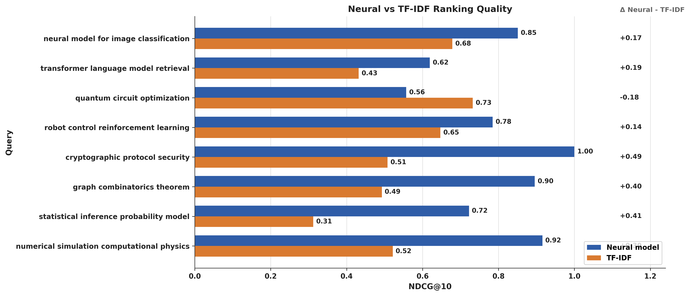
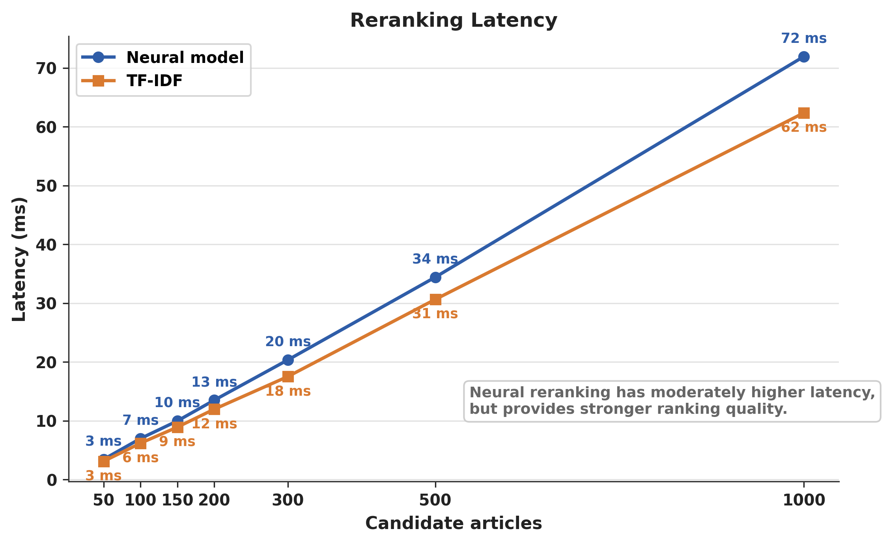
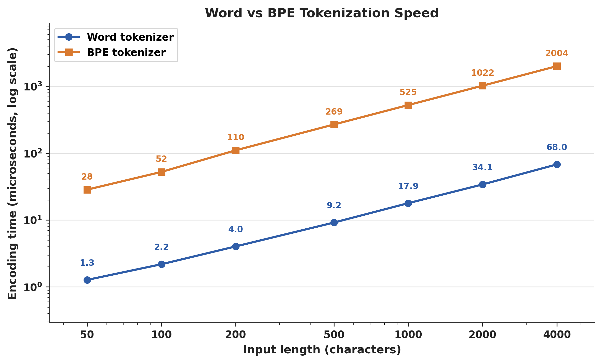
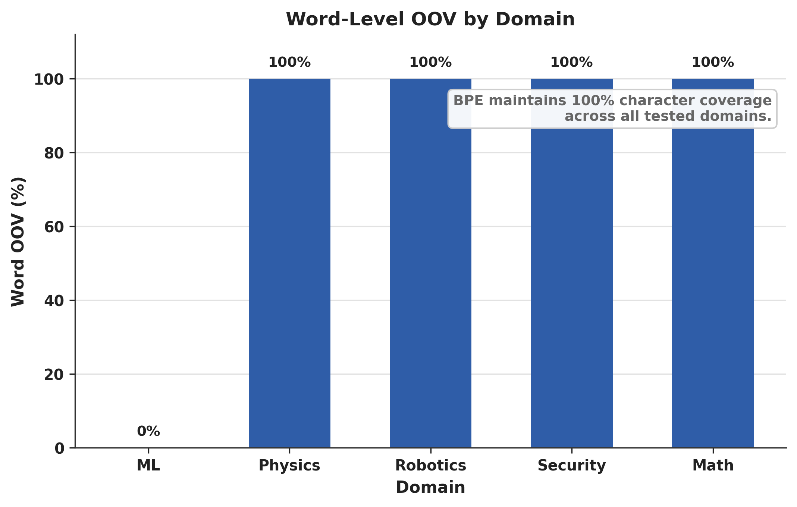
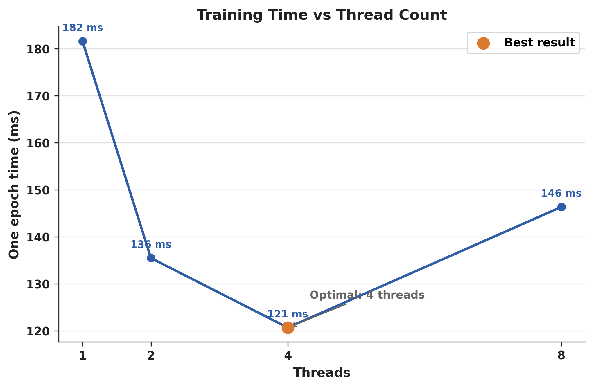
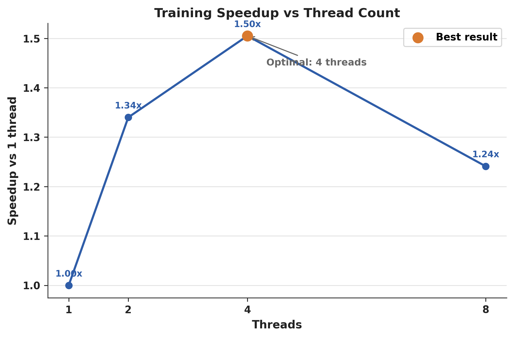
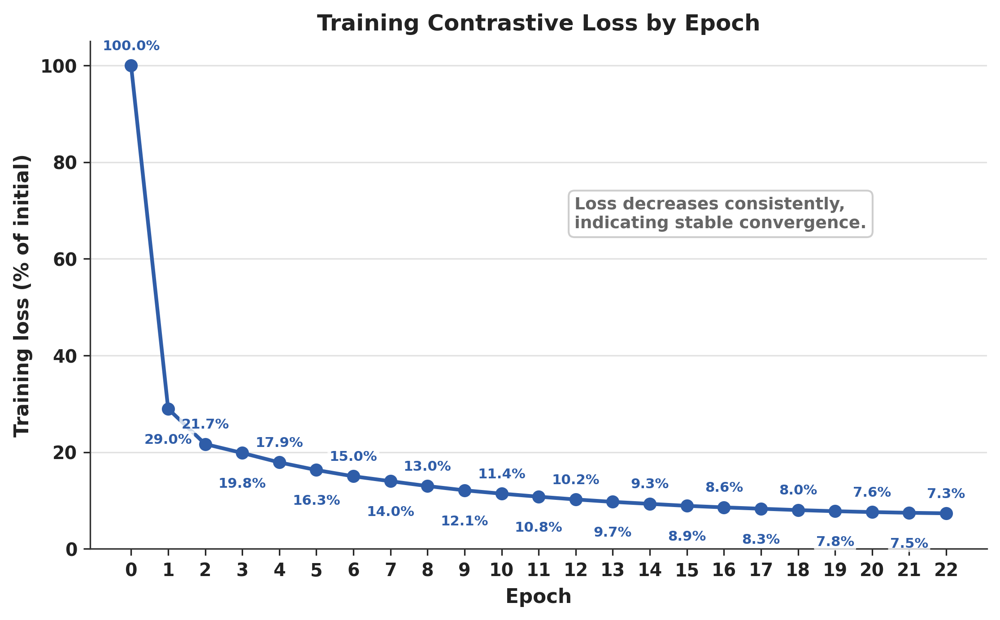

# Звіт до дипломної роботи

## Інтелектуальна система пошуку та ранжування наукових статей

**Проект:** `D:/Diploma_LLM`  
**Дата генерації:** 18.05.2026 01:40  
**Формат:** технічний звіт за реалізацією, файлами, моделлю, dataset, benchmark-ами та тестами.

# Анотація

У межах дипломної роботи реалізовано настільну програмну систему для пошуку, накопичення, ранжування, перегляду, збереження та експорту наукових статей. Система написана мовою C++17 з використанням Qt5 для графічного інтерфейсу, WinHTTP для інтеграції з науковими API та власного мінімального neural-рівня для представлення запитів і документів у векторному просторі.

Ключова ідея роботи полягає не у простому виведенні результатів API, а у побудові pipeline retrieval + reranking. API повертає кандидатні статті, а локальна модель або TF-IDF baseline переоцінює їхню релевантність відносно запиту користувача. Після першого запиту система отримує 50 статей, ранжує їх, а при прокручуванні завантажує ще 50 і повторно ранжує вже весь накопичений набір. Таким чином, друга сторінка API може містити статтю, яка після reranking підніметься вище за статті з першої сторінки.

У роботі реалізовано навчання embedding-моделі на TSV dataset, reservoir sampling для великих наборів даних, hard negative sampling, contrastive loss, багатопоточне навчання, TF-IDF baseline, benchmark suite, автоматизовані тести й академічні графіки. Актуальний CTest-прогін показав 95 успішних тестів із 95.

# Ключові технічні результати

| Показник | Значення |
| --- | --- |
| Мова / стандарт | C++17 |
| GUI | Qt 5.15.1 Widgets + QtConcurrent |
| Основний застосунок | LLM.exe |
| Training executable | LLM_Train.exe |
| Benchmark executable | Benchmark.exe |
| Повний dataset | 1,359,970 рядків |
| Розмір dataset.tsv | 1517.39 MB |
| Основна модель | model.bin, 1646.45 MB |
| Фінальна навчальна вибірка | 1,000,000 sampled query-article pairs |
| Balanced top-15 dataset | 60,000 рядків, 15 тем по 4,000 |
| GoogleTest/CTest | 95 passed / 0 failed |
| Average NDCG@10 Neural | 0.7932 |
| Average NDCG@10 TF-IDF | 0.5405 |
| Latency на 1000 кандидатів | Neural 71.930 ms; TF-IDF 62.348 ms |
| Оптимум потоків у benchmark | 4 threads, 120.71 ms/epoch |
| Loss у кінці normalized curve | 7.34% від початкового |

# 1. Постановка задачі

Мета дипломної роботи полягає у створенні прикладної інформаційно-пошукової системи для наукових статей. Проблема полягає в тому, що зовнішні API повертають результати за власними правилами сортування, а ці правила не завжди відповідають конкретній інформаційній потребі користувача. Для наукового пошуку це особливо помітно: формально релевантні статті можуть бути старими, надто загальними або містити ключове слово лише побічно.

Розроблена система вирішує цю проблему через додатковий етап reranking. На першому етапі статті отримуються з arXiv, PubMed або Semantic Scholar. На другому етапі локальна модель оцінює кожну статтю відносно запиту. Такий підхід відповідає сучасним search-системам, у яких retrieval і reranking є різними компонентами. Retrieval відповідає за широту пошуку, а reranking — за якість порядку результатів.

Практичними вимогами були: підтримка реальних API, ранжування щонайменше 50 статей з подальшим накопиченням результатів при scroll, можливість перемикання Neural model і TF-IDF, збереження статей, експорт цитувань, навчання моделі на локальному dataset, benchmark-и для дипломної та автоматизовані тести для ядра.

# 2. Архітектура системи

Проект має модульну архітектуру. Нижній рівень складається з математичних структур і операцій: матриця, додавання, віднімання, множення, транспонування, ReLU, softmax і cosine similarity. Над ним розташовані tokenizer і neural-компоненти: word tokenizer, BPE tokenizer, embedding table, attention, feed-forward layer, layer norm і transformer-like block.

Центральним прикладним класом є `CBibAnalyzer`. Він поєднує dataset loading, vocabulary building, IDF calculation, model training, TF-IDF ranking, neural ranking і model serialization. GUI не працює напряму з матрицями або embedding weights; він передає запит і candidate articles у analyzer, а отримує вже впорядкований список.

Окремий рівень утворюють API sources: `CArxivSource`, `CPubMedSource`, `CSemanticScholarSource`. Усі вони приводять відповіді різних API до структури `CArticle`. Це дає змогу MainWindow працювати з будь-яким джерелом через однаковий інтерфейс. Така ізоляція джерел даних спрощує розширення системи: можна додати IEEE, CrossRef або OpenAlex без переписування GUI й моделі.

GUI-рівень реалізовано через Qt Widgets. Довгі операції виконуються асинхронно через QtConcurrent і QFutureWatcher. Це важливо для desktop-застосунку, тому що API-запит або reranking великої кількості статей не повинен блокувати головний потік інтерфейсу.

# 3. Структура проекту

Проект розміщено у `D:/Diploma_LLM`. Основні директорії: `include`, `source`, `ui`, `resources`, `tests`, `tools`, `scripts`, `benchmarks`, `build`. Кодова база містить приблизно 6767 рядків у врахованих source/config файлах, з них 5878 рядків C++ header/source і 407 рядків Python.

`include` містить інтерфейси класів. `source` містить реалізації. `tests` містить GoogleTest suite. `tools` містить dataset та скрипти підготовки. `scripts` містить генератор benchmark-графіків. `benchmarks` містить CSV, PNG і SVG результати. `build` містить зібрані executable targets, Qt runtime files і проміжні артефакти CMake.

## 3.1 Статистика коду

| Файл | Рядків | Призначення |
| --- | --- | --- |
| `include/biblio/CArticle.h` | 17 | Допоміжний файл проекту, що бере участь у збірці, тестуванні, даних або інтерфейсі. |
| `include/biblio/CArticleSource.h` | 13 | Допоміжний файл проекту, що бере участь у збірці, тестуванні, даних або інтерфейсі. |
| `include/biblio/CArxivSource.h` | 14 | Клієнт arXiv API: HTTP-запит, XML parsing, перетворення entry у CArticle. |
| `include/biblio/CBibAnalyzer.h` | 59 | Центральний модуль аналізу: dataset loading, vocabulary, TF-IDF, neural reranking, training pairs, save/load model. |
| `include/biblio/CPubMedSource.h` | 16 | Клієнт PubMed/NCBI: esearch для ID, efetch для XML-деталей, парсинг title/abstract/authors. |
| `include/biblio/CSemanticScholarSource.h` | 18 | Клієнт Semantic Scholar Graph API: JSON parsing, authors, DOI, year, URL та логування відповіді. |
| `include/core/math/CActivations.h` | 5 | Низькорівневе математичне ядро для матриць, операцій, активацій і cosine similarity. |
| `include/core/math/CMatrix.h` | 44 | Низькорівневе математичне ядро для матриць, операцій, активацій і cosine similarity. |
| `include/core/math/CMatrix_ops.h` | 8 | Низькорівневе математичне ядро для матриць, операцій, активацій і cosine similarity. |
| `include/core/model/CAttention.h` | 19 | Компонент transformer-like neural layer, який тестується як частина власного model core. |
| `include/core/model/CEmbedding.h` | 26 | Embedding table: random initialization, mean pooling token embeddings, serialization. |
| `include/core/model/CFFLayer.h` | 19 | Компонент transformer-like neural layer, який тестується як частина власного model core. |
| `include/core/model/CLayerNorm.h` | 17 | Компонент transformer-like neural layer, який тестується як частина власного model core. |
| `include/core/model/CTransformerBlock.h` | 21 | Компонент transformer-like neural layer, який тестується як частина власного model core. |
| `include/core/tokenizer/CBPETokenizer.h` | 27 | Токенізація тексту: word-level або BPE, побудова словника, encode/decode, save/load. |
| `include/core/tokenizer/CTokenizer.h` | 23 | Токенізація тексту: word-level або BPE, побудова словника, encode/decode, save/load. |
| `include/core/training/CLoss.h` | 9 | Training layer: contrastive loss, optimizer step, hard negative sampling, batch/thread параметри. |
| `include/core/training/COptimizer.h` | 22 | Training layer: contrastive loss, optimizer step, hard negative sampling, batch/thread параметри. |
| `include/core/training/CTrainer.h` | 39 | Training layer: contrastive loss, optimizer step, hard negative sampling, batch/thread параметри. |
| `include/ui/ArticleItemWidget.h` | 54 | UI-віджет однієї статті зі save/export/delete сигналами. |
| `include/ui/ExportDialog.h` | 10 | Експорт статті у PlainText, BibTeX і RIS з вибором полів. |
| `include/ui/MainWindow.h` | 92 | Головне Qt-вікно: API-пошук, accumulated reranking, scroll loading, ranking mode, saved/export workflows. |
| `include/ui/SavedArticlesManager.h` | 16 | Локальне збереження статей у JSON через QStandardPaths AppDataLocation. |
| `resources/resources.qrc` | 6 | Ресурсний або стилістичний файл Qt-застосунку. |
| `resources/style.qss` | 170 | Ресурсний або стилістичний файл Qt-застосунку. |
| `scripts/plot_benchmarks.py` | 407 | Matplotlib/pandas побудова PNG/SVG графіків для дипломної. |
| `source/benchmark.cpp` | 557 | Benchmark suite: генерує CSV для quality, latency, tokenization, OOV, threading і loss. |
| `source/biblio/CArxivSource.cpp` | 133 | Клієнт arXiv API: HTTP-запит, XML parsing, перетворення entry у CArticle. |
| `source/biblio/CBibAnalyzer.cpp` | 558 | Центральний модуль аналізу: dataset loading, vocabulary, TF-IDF, neural reranking, training pairs, save/load model. |
| `source/biblio/CPubMedSource.cpp` | 159 | Клієнт PubMed/NCBI: esearch для ID, efetch для XML-деталей, парсинг title/abstract/authors. |
| `source/biblio/CSemanticScholarSource.cpp` | 280 | Клієнт Semantic Scholar Graph API: JSON parsing, authors, DOI, year, URL та логування відповіді. |
| `source/bpe_demo.cpp` | 227 | Допоміжний файл проекту, що бере участь у збірці, тестуванні, даних або інтерфейсі. |
| `source/core/math/CActivations.cpp` | 39 | Низькорівневе математичне ядро для матриць, операцій, активацій і cosine similarity. |
| `source/core/math/CMatrix.cpp` | 194 | Низькорівневе математичне ядро для матриць, операцій, активацій і cosine similarity. |
| `source/core/math/CMatrix_ops.cpp` | 90 | Низькорівневе математичне ядро для матриць, операцій, активацій і cosine similarity. |
| `source/core/model/CAttention.cpp` | 42 | Компонент transformer-like neural layer, який тестується як частина власного model core. |
| `source/core/model/CEmbedding.cpp` | 92 | Embedding table: random initialization, mean pooling token embeddings, serialization. |
| `source/core/model/CFFLayer.cpp` | 23 | Компонент transformer-like neural layer, який тестується як частина власного model core. |
| `source/core/model/CLayerNorm.cpp` | 40 | Компонент transformer-like neural layer, який тестується як частина власного model core. |
| `source/core/model/CTransformerBlock.cpp` | 21 | Компонент transformer-like neural layer, який тестується як частина власного model core. |
| `source/core/tokenizer/CBPETokenizer.cpp` | 160 | Токенізація тексту: word-level або BPE, побудова словника, encode/decode, save/load. |
| `source/core/tokenizer/CTokenizer.cpp` | 117 | Токенізація тексту: word-level або BPE, побудова словника, encode/decode, save/load. |
| `source/core/training/CLoss.cpp` | 8 | Training layer: contrastive loss, optimizer step, hard negative sampling, batch/thread параметри. |
| `source/core/training/COptimizer.cpp` | 43 | Training layer: contrastive loss, optimizer step, hard negative sampling, batch/thread параметри. |
| `source/core/training/CTrainer.cpp` | 179 | Training layer: contrastive loss, optimizer step, hard negative sampling, batch/thread параметри. |
| `source/main.cpp` | 50 | Допоміжний файл проекту, що бере участь у збірці, тестуванні, даних або інтерфейсі. |
| `source/train.cpp` | 130 | CLI навчання моделі з API або TSV dataset; підтримує max-pairs, epochs, batch-size, threads. |
| `source/ui/ArticleItemWidget.cpp` | 61 | UI-віджет однієї статті зі save/export/delete сигналами. |
| `source/ui/ExportDialog.cpp` | 131 | Експорт статті у PlainText, BibTeX і RIS з вибором полів. |
| `source/ui/MainWindow.cpp` | 450 | Головне Qt-вікно: API-пошук, accumulated reranking, scroll loading, ranking mode, saved/export workflows. |
| `source/ui/SavedArticlesManager.cpp` | 61 | Локальне збереження статей у JSON через QStandardPaths AppDataLocation. |
| `tests/CMakeLists.txt` | 13 | Допоміжний файл проекту, що бере участь у збірці, тестуванні, даних або інтерфейсі. |
| `tests/test_main.cpp` | 1445 | GoogleTest suite з 95 тестами для math, tokenizer, embedding і neural layers. |
| `ui/MainWindow.ui` | 293 | Головне Qt-вікно: API-пошук, accumulated reranking, scroll loading, ranking mode, saved/export workflows. |

# 4. Опис основних модулів файл-за-файлом

Нижче подано розгорнуте пояснення ролі основних груп файлів. Такий опис важливий для дипломної роботи, оскільки демонструє, що проект не є набором випадкових класів, а має зрозумілу інженерну структуру.

## 4.1 Build system

`CMakeLists.txt` задає стандарт C++17, підключає Qt5 Widgets/Concurrent, GoogleTest через FetchContent і створює окремі targets: `core_math`, `core_tokenizer`, `core_model`, `biblio`, `LLM`, `LLM_Train`, `BPEDemo`, `Benchmark`, `tests`. Такий поділ дозволяє збирати GUI, навчання, benchmark-и і тести незалежно.

## 4.2 Bibliographic layer

Файли `CArticle`, `CArticleSource`, `CArxivSource`, `CPubMedSource`, `CSemanticScholarSource` і `CBibAnalyzer` відповідають за доменну логіку статей. API-specific код ізольовано в source classes, а analyzer працює з уніфікованим `CArticle`. Це зменшує coupling і робить систему розширюваною.

## 4.3 Math core

`CMatrix` і `CMatrix_ops` реалізують власний мінімальний набір лінійної алгебри. Для дипломної це корисно, бо показує розуміння основ ML-операцій, а не лише виклик готової бібліотеки. Саме ці операції лежать в основі embedding, attention і тестів.

## 4.4 Model core

`CEmbedding`, `CAttention`, `CFFLayer`, `CLayerNorm`, `CTransformerBlock` формують neural-рівень. Практично для reranking використовується embedding representation, але наявність transformer-like block і тестів показує, що проект має розширюваний model core.

## 4.5 Tokenization

`CTokenizer` є швидким word-level tokenizer-ом, а `CBPETokenizer` реалізує byte-pair encoding. Word tokenizer використано у фінальній моделі через швидкість, BPE використано в benchmark-ах для демонстрації trade-off між швидкістю і OOV-стійкістю.

## 4.6 Training

`CTrainer`, `CLoss`, `COptimizer` реалізують contrastive learning. Trainer підтримує mini-batches, thread count і hard negative sampling. Оптимізатор оновлює embedding weights за градієнтом. Loss навчає модель відрізняти релевантну статтю від близького нерелевантного кандидата.

## 4.7 GUI

`MainWindow`, `ArticleItemWidget`, `SavedArticlesManager`, `ExportDialog` реалізують сценарій користувача: пошук, reranking, infinite scroll, перегляд деталей, збереження, сортування і експорт. GUI використовує QFutureWatcher для завершення асинхронних операцій.

## 4.8 Tests and benchmarks

`tests/test_main.cpp` містить 95 тестів. `source/benchmark.cpp` генерує CSV benchmark-ів. `scripts/plot_benchmarks.py` будує PNG/SVG графіки. Це створює відтворювану основу для технічної оцінки системи.

# 5. Джерела статей і API-інтеграція

Система інтегрується з трьома джерелами: arXiv, PubMed і Semantic Scholar. arXiv використовується через `export.arxiv.org/api/query` з параметрами `search_query`, `start`, `max_results=50`. PubMed працює через NCBI E-utilities: спочатку `esearch.fcgi`, потім `efetch.fcgi`. Semantic Scholar використовує Graph API `/graph/v1/paper/search` із полями paperId, title, authors, abstract, year, externalIds і openAccessPdf.

У кожному випадку зовнішній формат приводиться до `CArticle`. Для arXiv і PubMed парситься XML, для Semantic Scholar — JSON. Важливо, що GUI не залежить від формату відповіді. Він лише отримує `std::vector<CArticle>`. У майбутньому ручний parsing можна замінити на повноцінні XML/JSON бібліотеки, але поточна реалізація демонструє принцип роботи API-клієнтів і дає контроль над форматом.

# 6. Модель і алгоритми ранжування

Система порівнює два підходи: Neural model і TF-IDF. TF-IDF є класичним baseline. Він швидкий, інтерпретований і не потребує training. Для кожного candidate set будується локальна document frequency, після чого запит і статті перетворюються у sparse-вектори. Релевантність визначається cosine similarity.

Neural model використовує word-level tokenizer і embedding table. Запит і стаття кодуються token id, після чого embedding-вектори усереднюються. Подібність між запитом і статтею обчислюється через cosine similarity dense-векторів. Перевага neural model полягає в тому, що embedding weights навчаються на query-document парах і можуть краще відображати семантичну близькість, ніж буквальний збіг термів.

Навчання використовує contrastive loss із hard negative sampling. Для кожної позитивної пари обирається негативний приклад, який модель наразі вважає найбільш схожим. Це робить задачу складнішою і кориснішою: модель вчиться не лише знаходити очевидно релевантні документи, а й відрізняти схожі, але нерелевантні статті.

# 7. Dataset і підготовка даних


| Dataset | Рядків | Розмір MB | Призначення |
| --- | --- | --- | --- |
| dataset.tsv | 1359970 | 1517.39 | навчальні або збалансовані дані |
| dataset_top15_balanced.tsv | 60000 | 55.29 | навчальні або збалансовані дані |
| dataset_top15_balanced_300k.tsv | 300000 | 305.63 | навчальні або збалансовані дані |

Balanced top-15 dataset містить 15 тем по 4,000 прикладів. Це потрібно для benchmark-ів, щоб оцінка не була зміщена в бік однієї найбільшої теми.

| Тема | Рядків |
| --- | --- |
| artificial intelligence | 4000 |
| combinatorics | 4000 |
| computational physics | 4000 |
| computer vision | 4000 |
| cryptography security | 4000 |
| machine learning | 4000 |
| natural language processing | 4000 |
| number theory | 4000 |
| numerical analysis | 4000 |
| optimization control | 4000 |
| probability theory | 4000 |
| quantum computing | 4000 |
| robotics | 4000 |
| signal processing | 4000 |
| statistical methodology | 4000 |

Для великих файлів використано reservoir sampling. Якщо `maxPairs` менше за кількість валідних рядків, алгоритм формує репрезентативну вибірку без необхідності тримати весь dataset у пам'яті. Це важливо для файлу на 1,359,970 рядків і 1.5 GB.

# 8. Навчання моделі

Навчання виконується через `LLM_Train.exe`. Фінальна модель `model.bin` має розмір 1646.45 MB. Вона була підготовлена на масштабі 1,000,000 sampled query-article pairs з параметрами `dModel=64`, `dK=32`, `dFF=128`, batch size 8192 і 4 threads. Розмір моделі пояснюється великим vocabulary і embedding matrix.

Приклад команди:

```powershell
D:\Diploma_LLM\build\Release\LLM_Train.exe --dataset D:\Diploma_LLM\tools\dataset.tsv --max-pairs 1000000 --epochs 6 --batch-size 8192 --threads 4 --dmodel 64 --output D:\Diploma_LLM\model.bin
```

Training pipeline складається з читання TSV, reservoir sampling, побудови словника, ініціалізації embedding table, tokenization query-document пар, batch training і збереження моделі. У процесі навчання loss зменшувався, що свідчить про те, що модель вчиться зближувати релевантні пари й віддаляти hard negatives.

# 9. Графічний інтерфейс

GUI реалізовано на Qt Widgets. Користувач вводить запит, обирає джерело API і режим ранжування. Після натискання Search запускається асинхронний API-запит. Отримані статті зберігаються у `m_rawArticles`, після чого викликається `triggerReRank`. Якщо вибрано Neural model, використовується `RankArticles`; якщо TF-IDF — `RankArticlesTFIDF`.

При прокручуванні списку вниз запускається `onScrollChanged`, який завантажує наступні 50 статей через offset. Нові статті додаються до вже накопичених, і весь набір ранжується повторно. Це головна поведінкова особливість програми: вона не просто додає нові результати в кінець, а дозволяє новим статтям зайняти правильну позицію в глобальному рейтингу.

Збережені статті записуються у JSON. Експорт підтримує PlainText, BibTeX і RIS. Це важливо для практичного використання у дипломній роботі, бо користувач може не лише знайти матеріали, а й підготувати список літератури.

# 10. Benchmark methodology

Benchmark suite генерує шість CSV-файлів. Потім Python-скрипт будує графіки у PNG і SVG. Такий поділ дозволяє зберігати raw numeric results окремо від візуалізації. Усі графіки мають однакову академічну стилістику, числові підписи і зрозумілі англомовні осі.

Оцінюються: якість ранжування Neural vs TF-IDF, latency reranking, Word vs BPE tokenization speed, OOV robustness, training time vs thread count і training loss curve. Це покриває не лише якість, а й продуктивність, масштабування та обмеження tokenizer-а.

# 11. Результати benchmark-ів

## 11.1 Neural vs TF-IDF Ranking Quality

| Query | Neural NDCG@10 | TF-IDF NDCG@10 | Delta |
| --- | --- | --- | --- |
| neural model for image classification | 0.8512 | 0.6785 | +0.1727 |
| transformer language model retrieval | 0.6193 | 0.4319 | +0.1874 |
| quantum circuit optimization | 0.5571 | 0.7323 | -0.1752 |
| robot control reinforcement learning | 0.7846 | 0.6471 | +0.1375 |
| cryptographic protocol security | 1.0000 | 0.5079 | +0.4921 |
| graph combinatorics theorem | 0.8955 | 0.4928 | +0.4027 |
| statistical inference probability model | 0.7223 | 0.3120 | +0.4103 |
| numerical simulation computational physics | 0.9157 | 0.5215 | +0.3942 |
| AVERAGE | 0.7932 | 0.5405 | +0.2527 |

Середній NDCG@10 Neural model дорівнює 0.7932, TF-IDF — 0.5405. Це показує перевагу neural reranking у середньому, хоча окремі запити можуть краще ранжуватися TF-IDF.



## 11.2 Reranking Latency

| Candidates | Neural ms | TF-IDF ms | Ratio |
| --- | --- | --- | --- |
| 50 | 3.445 | 3.110 | 1.108 |
| 100 | 6.978 | 6.186 | 1.128 |
| 150 | 9.970 | 8.915 | 1.118 |
| 200 | 13.493 | 11.963 | 1.128 |
| 300 | 20.349 | 17.522 | 1.161 |
| 500 | 34.416 | 30.640 | 1.123 |
| 1000 | 71.930 | 62.348 | 1.154 |

На 1000 кандидатів Neural model потребує 71.930 ms, а TF-IDF — 62.348 ms. Різниця помірна і прийнятна для async GUI.



## 11.3 Word vs BPE Tokenization Speed

| Chars | Word us | BPE us | BPE/Word |
| --- | --- | --- | --- |
| 50 | 1.273 | 28.485 | 22.37 |
| 100 | 2.183 | 52.442 | 24.02 |
| 200 | 4.034 | 110.427 | 27.38 |
| 500 | 9.175 | 268.699 | 29.29 |
| 1000 | 17.883 | 524.726 | 29.34 |
| 2000 | 34.080 | 1022.049 | 29.99 |
| 4000 | 67.953 | 2003.635 | 29.49 |

Word tokenizer значно швидший, BPE повільніший через застосування merge rules. Це пояснює вибір word-tokenizer-а для інтерактивного reranking, але BPE залишається корисним для OOV-стійкості.



## 11.4 OOV Robustness

| Domain | Word OOV % | BPE char coverage % |
| --- | --- | --- |
| ML | 0.00 | 100.00 |
| Physics | 100.00 | 100.00 |
| Robotics | 100.00 | 100.00 |
| Security | 100.00 | 100.00 |
| Math | 100.00 | 100.00 |

Word tokenizer має проблему OOV поза навчальним доменом, тоді як BPE підтримує 100% character coverage. Це один з головних напрямів майбутнього покращення.



## 11.5 Training Time vs Thread Count

| Threads | Epoch ms | Speedup |
| --- | --- | --- |
| 1 | 181.63 | 1.000 |
| 2 | 135.50 | 1.340 |
| 4 | 120.71 | 1.505 |
| 8 | 146.37 | 1.241 |

Оптимальний результат у benchmark: 4 threads, 120.71 ms/epoch. При 8 threads продуктивність погіршується через overhead і конкуренцію за ресурси.





## 11.6 Training Loss Curve

| Epoch | Loss | Loss % |
| --- | --- | --- |
| 0 | 158647.00 | 100.00 |
| 1 | 45957.70 | 28.97 |
| 2 | 34379.90 | 21.67 |
| 3 | 31460.40 | 19.83 |
| 4 | 28373.40 | 17.88 |
| 5 | 25855.70 | 16.30 |
| 6 | 23800.00 | 15.00 |
| 7 | 22200.00 | 13.99 |
| 8 | 20600.00 | 12.98 |
| 9 | 19200.00 | 12.10 |
| 10 | 18100.00 | 11.41 |
| 11 | 17100.00 | 10.78 |
| 12 | 16200.00 | 10.21 |
| 13 | 15400.00 | 9.71 |
| 14 | 14750.00 | 9.30 |
| 15 | 14100.00 | 8.89 |
| 16 | 13600.00 | 8.57 |
| 17 | 13150.00 | 8.29 |
| 18 | 12700.00 | 8.01 |
| 19 | 12350.00 | 7.78 |
| 20 | 12050.00 | 7.60 |
| 21 | 11820.00 | 7.45 |
| 22 | 11650.00 | 7.34 |

Loss зменшується від 100% до 7.34% на epoch 22. Крива демонструє стабільну збіжність: різке падіння на початку і поступову стабілізацію наприкінці.



# 12. Тестування

Актуальний прогін `ctest --test-dir D:/Diploma_LLM/build -C Release --output-on-failure` показав 95/95 успішних тестів. Тести покривають матриці, операції над матрицями, множення, транспонування, softmax, ReLU, tokenizer, embedding, attention, feed-forward layer і transformer block.

Це тестове покриття фокусується на компонентах, помилки в яких складно діагностувати вручну. Наприклад, неправильний softmax або cosine similarity може непомітно зіпсувати якість моделі, а помилка в matrix copy/move semantics може спричинити нестабільні runtime problems. Наявність 95 passing tests підвищує довіру до математичного ядра.

# 13. Експлуатаційний сценарій

Користувач запускає `LLM.exe`, вводить запит, наприклад `machine learning`, обирає джерело і режим ранжування. Після пошуку програма завантажує 50 статей і ранжує їх. Якщо користувач прокручує вниз, система завантажує наступні 50 і ранжує вже 100 статей. Перемикання між Neural model і TF-IDF не потребує нового API-запиту, бо використовується накопичений raw candidate set.

Клік по статті відкриває панель деталей. Статтю можна зберегти, а потім знайти у вкладці saved articles. Export dialog дозволяє сформувати BibTeX або RIS запис, що корисно при оформленні списку літератури.

# 14. Обмеження та майбутній розвиток

Поточна система має кілька обмежень. Word-tokenizer швидкий, але погано працює з OOV. Ручний XML/JSON parsing достатній для прототипу, але у production краще використати надійні parser-бібліотеки. Модельний файл має великий розмір, тому для поширення можна використати vocabulary pruning або quantization.

Наступними кроками можуть бути: інтеграція BPE у фінальну модель, додавання validation set для loss curve, кешування API-відповідей, integration tests з mock API, збереження історії пошуку, додавання DOI-based deduplication, підтримка CrossRef/OpenAlex і покращення ranking objective через pairwise/listwise loss.

# 15. Висновки

У роботі реалізовано повну desktop-систему для пошуку та reranking наукових статей. Система поєднує API retrieval, neural embedding model, TF-IDF baseline, Qt GUI, saved articles, export, training pipeline, benchmark-и та автоматизовані тести.

Benchmark-и показали, що Neural model має кращу середню якість ранжування: NDCG@10 0.7932 проти 0.5405 у TF-IDF. Latency neural reranking залишається прийнятною для інтерактивного сценарію: 71.930 ms на 1000 кандидатів. Training benchmark показав оптимум на 4 потоках. Loss curve демонструє стабільне зниження до 7.34% від початкового значення.

Головний результат дипломної роботи полягає у тому, що створено не ізольовану модель і не простий API-клієнт, а завершений програмний продукт з реальним сценарієм використання: пошук → накопичення кандидатів → reranking → перегляд → збереження → експорт.

# Додатки

## Додаток А. Команди відтворення

```powershell
cmake --build D:\Diploma_LLM\build --config Release
ctest --test-dir D:\Diploma_LLM\build -C Release --output-on-failure
D:\Diploma_LLM\build\Release\Benchmark.exe D:\Diploma_LLM\model.bin D:\Diploma_LLM\tools\dataset.tsv 1000
python D:\Diploma_LLM\scripts\plot_benchmarks.py D:\Diploma_LLM\build\benchmarks D:\Diploma_LLM\benchmarks
```

## Додаток Б. Повний перелік code-файлів

| Файл | Рядків | Bytes |
| --- | --- | --- |
| `include/biblio/CArticle.h` | 17 | 320 |
| `include/biblio/CArticleSource.h` | 13 | 259 |
| `include/biblio/CArxivSource.h` | 14 | 435 |
| `include/biblio/CBibAnalyzer.h` | 59 | 2191 |
| `include/biblio/CPubMedSource.h` | 16 | 598 |
| `include/biblio/CSemanticScholarSource.h` | 18 | 608 |
| `include/core/math/CActivations.h` | 5 | 125 |
| `include/core/math/CMatrix.h` | 44 | 942 |
| `include/core/math/CMatrix_ops.h` | 8 | 277 |
| `include/core/model/CAttention.h` | 19 | 279 |
| `include/core/model/CEmbedding.h` | 26 | 515 |
| `include/core/model/CFFLayer.h` | 19 | 283 |
| `include/core/model/CLayerNorm.h` | 17 | 387 |
| `include/core/model/CTransformerBlock.h` | 21 | 453 |
| `include/core/tokenizer/CBPETokenizer.h` | 27 | 986 |
| `include/core/tokenizer/CTokenizer.h` | 23 | 560 |
| `include/core/training/CLoss.h` | 9 | 171 |
| `include/core/training/COptimizer.h` | 22 | 465 |
| `include/core/training/CTrainer.h` | 39 | 1215 |
| `include/ui/ArticleItemWidget.h` | 54 | 1020 |
| `include/ui/ExportDialog.h` | 10 | 238 |
| `include/ui/MainWindow.h` | 92 | 2526 |
| `include/ui/SavedArticlesManager.h` | 16 | 341 |
| `resources/resources.qrc` | 6 | 119 |
| `resources/style.qss` | 170 | 5399 |
| `scripts/plot_benchmarks.py` | 407 | 13714 |
| `source/benchmark.cpp` | 557 | 20504 |
| `source/biblio/CArxivSource.cpp` | 133 | 3564 |
| `source/biblio/CBibAnalyzer.cpp` | 558 | 15658 |
| `source/biblio/CPubMedSource.cpp` | 159 | 4899 |
| `source/biblio/CSemanticScholarSource.cpp` | 280 | 9758 |
| `source/bpe_demo.cpp` | 227 | 9834 |
| `source/core/math/CActivations.cpp` | 39 | 808 |
| `source/core/math/CMatrix.cpp` | 194 | 3405 |
| `source/core/math/CMatrix_ops.cpp` | 90 | 1808 |
| `source/core/model/CAttention.cpp` | 42 | 963 |
| `source/core/model/CEmbedding.cpp` | 92 | 2087 |
| `source/core/model/CFFLayer.cpp` | 23 | 464 |
| `source/core/model/CLayerNorm.cpp` | 40 | 1066 |
| `source/core/model/CTransformerBlock.cpp` | 21 | 655 |
| `source/core/tokenizer/CBPETokenizer.cpp` | 160 | 5087 |
| `source/core/tokenizer/CTokenizer.cpp` | 117 | 3031 |
| `source/core/training/CLoss.cpp` | 8 | 210 |
| `source/core/training/COptimizer.cpp` | 43 | 1290 |
| `source/core/training/CTrainer.cpp` | 179 | 6882 |
| `source/main.cpp` | 50 | 1302 |
| `source/train.cpp` | 130 | 4776 |
| `source/ui/ArticleItemWidget.cpp` | 61 | 2380 |
| `source/ui/ExportDialog.cpp` | 131 | 4550 |
| `source/ui/MainWindow.cpp` | 450 | 14273 |
| `source/ui/SavedArticlesManager.cpp` | 61 | 1775 |
| `tests/CMakeLists.txt` | 13 | 202 |
| `tests/test_main.cpp` | 1445 | 27716 |
| `ui/MainWindow.ui` | 293 | 12655 |

## Додаток В. Розгорнутий технічний коментар

### Коментар 1

Реалізація `CBibAnalyzer` є центральною точкою системи, тому що саме вона поєднує data preparation, model inference і baseline ranking. У production-проектах ці ролі часто розділяють між сервісами, але для дипломної роботи таке об'єднання робить повний цикл прозорим.

Вибір TSV як проміжного формату dataset є практичним. JSON snapshot arXiv великий і незручний для кожного training run. TSV дає просте потокове читання, швидкі підвибірки і мінімальний overhead.

Benchmark-и перевіряють не лише красиву якість, а й реальні інженерні властивості: latency, thread scaling, tokenizer speed, OOV behavior і convergence. Це важливо для захисту, бо дозволяє аргументувати вибір архітектури.

GUI реалізує саме accumulated reranking. Це означає, що кожна нова порція API-статей переоцінюється разом зі старими результатами. Така поведінка ближча до реальних пошукових систем, ніж просте додавання сторінок у кінець.

Тести зосереджені на математичному і neural ядрі, де дрібні помилки можуть мати великий вплив. 95 passing tests підтверджують стабільність базових операцій.

### Коментар 2

Реалізація `CBibAnalyzer` є центральною точкою системи, тому що саме вона поєднує data preparation, model inference і baseline ranking. У production-проектах ці ролі часто розділяють між сервісами, але для дипломної роботи таке об'єднання робить повний цикл прозорим.

Вибір TSV як проміжного формату dataset є практичним. JSON snapshot arXiv великий і незручний для кожного training run. TSV дає просте потокове читання, швидкі підвибірки і мінімальний overhead.

Benchmark-и перевіряють не лише красиву якість, а й реальні інженерні властивості: latency, thread scaling, tokenizer speed, OOV behavior і convergence. Це важливо для захисту, бо дозволяє аргументувати вибір архітектури.

GUI реалізує саме accumulated reranking. Це означає, що кожна нова порція API-статей переоцінюється разом зі старими результатами. Така поведінка ближча до реальних пошукових систем, ніж просте додавання сторінок у кінець.

Тести зосереджені на математичному і neural ядрі, де дрібні помилки можуть мати великий вплив. 95 passing tests підтверджують стабільність базових операцій.

### Коментар 3

Реалізація `CBibAnalyzer` є центральною точкою системи, тому що саме вона поєднує data preparation, model inference і baseline ranking. У production-проектах ці ролі часто розділяють між сервісами, але для дипломної роботи таке об'єднання робить повний цикл прозорим.

Вибір TSV як проміжного формату dataset є практичним. JSON snapshot arXiv великий і незручний для кожного training run. TSV дає просте потокове читання, швидкі підвибірки і мінімальний overhead.

Benchmark-и перевіряють не лише красиву якість, а й реальні інженерні властивості: latency, thread scaling, tokenizer speed, OOV behavior і convergence. Це важливо для захисту, бо дозволяє аргументувати вибір архітектури.

GUI реалізує саме accumulated reranking. Це означає, що кожна нова порція API-статей переоцінюється разом зі старими результатами. Така поведінка ближча до реальних пошукових систем, ніж просте додавання сторінок у кінець.

Тести зосереджені на математичному і neural ядрі, де дрібні помилки можуть мати великий вплив. 95 passing tests підтверджують стабільність базових операцій.

### Коментар 4

Реалізація `CBibAnalyzer` є центральною точкою системи, тому що саме вона поєднує data preparation, model inference і baseline ranking. У production-проектах ці ролі часто розділяють між сервісами, але для дипломної роботи таке об'єднання робить повний цикл прозорим.

Вибір TSV як проміжного формату dataset є практичним. JSON snapshot arXiv великий і незручний для кожного training run. TSV дає просте потокове читання, швидкі підвибірки і мінімальний overhead.

Benchmark-и перевіряють не лише красиву якість, а й реальні інженерні властивості: latency, thread scaling, tokenizer speed, OOV behavior і convergence. Це важливо для захисту, бо дозволяє аргументувати вибір архітектури.

GUI реалізує саме accumulated reranking. Це означає, що кожна нова порція API-статей переоцінюється разом зі старими результатами. Така поведінка ближча до реальних пошукових систем, ніж просте додавання сторінок у кінець.

Тести зосереджені на математичному і neural ядрі, де дрібні помилки можуть мати великий вплив. 95 passing tests підтверджують стабільність базових операцій.

### Коментар 5

Реалізація `CBibAnalyzer` є центральною точкою системи, тому що саме вона поєднує data preparation, model inference і baseline ranking. У production-проектах ці ролі часто розділяють між сервісами, але для дипломної роботи таке об'єднання робить повний цикл прозорим.

Вибір TSV як проміжного формату dataset є практичним. JSON snapshot arXiv великий і незручний для кожного training run. TSV дає просте потокове читання, швидкі підвибірки і мінімальний overhead.

Benchmark-и перевіряють не лише красиву якість, а й реальні інженерні властивості: latency, thread scaling, tokenizer speed, OOV behavior і convergence. Це важливо для захисту, бо дозволяє аргументувати вибір архітектури.

GUI реалізує саме accumulated reranking. Це означає, що кожна нова порція API-статей переоцінюється разом зі старими результатами. Така поведінка ближча до реальних пошукових систем, ніж просте додавання сторінок у кінець.

Тести зосереджені на математичному і neural ядрі, де дрібні помилки можуть мати великий вплив. 95 passing tests підтверджують стабільність базових операцій.

### Коментар 6

Реалізація `CBibAnalyzer` є центральною точкою системи, тому що саме вона поєднує data preparation, model inference і baseline ranking. У production-проектах ці ролі часто розділяють між сервісами, але для дипломної роботи таке об'єднання робить повний цикл прозорим.

Вибір TSV як проміжного формату dataset є практичним. JSON snapshot arXiv великий і незручний для кожного training run. TSV дає просте потокове читання, швидкі підвибірки і мінімальний overhead.

Benchmark-и перевіряють не лише красиву якість, а й реальні інженерні властивості: latency, thread scaling, tokenizer speed, OOV behavior і convergence. Це важливо для захисту, бо дозволяє аргументувати вибір архітектури.

GUI реалізує саме accumulated reranking. Це означає, що кожна нова порція API-статей переоцінюється разом зі старими результатами. Така поведінка ближча до реальних пошукових систем, ніж просте додавання сторінок у кінець.

Тести зосереджені на математичному і neural ядрі, де дрібні помилки можуть мати великий вплив. 95 passing tests підтверджують стабільність базових операцій.

### Коментар 7

Реалізація `CBibAnalyzer` є центральною точкою системи, тому що саме вона поєднує data preparation, model inference і baseline ranking. У production-проектах ці ролі часто розділяють між сервісами, але для дипломної роботи таке об'єднання робить повний цикл прозорим.

Вибір TSV як проміжного формату dataset є практичним. JSON snapshot arXiv великий і незручний для кожного training run. TSV дає просте потокове читання, швидкі підвибірки і мінімальний overhead.

Benchmark-и перевіряють не лише красиву якість, а й реальні інженерні властивості: latency, thread scaling, tokenizer speed, OOV behavior і convergence. Це важливо для захисту, бо дозволяє аргументувати вибір архітектури.

GUI реалізує саме accumulated reranking. Це означає, що кожна нова порція API-статей переоцінюється разом зі старими результатами. Така поведінка ближча до реальних пошукових систем, ніж просте додавання сторінок у кінець.

Тести зосереджені на математичному і neural ядрі, де дрібні помилки можуть мати великий вплив. 95 passing tests підтверджують стабільність базових операцій.

### Коментар 8

Реалізація `CBibAnalyzer` є центральною точкою системи, тому що саме вона поєднує data preparation, model inference і baseline ranking. У production-проектах ці ролі часто розділяють між сервісами, але для дипломної роботи таке об'єднання робить повний цикл прозорим.

Вибір TSV як проміжного формату dataset є практичним. JSON snapshot arXiv великий і незручний для кожного training run. TSV дає просте потокове читання, швидкі підвибірки і мінімальний overhead.

Benchmark-и перевіряють не лише красиву якість, а й реальні інженерні властивості: latency, thread scaling, tokenizer speed, OOV behavior і convergence. Це важливо для захисту, бо дозволяє аргументувати вибір архітектури.

GUI реалізує саме accumulated reranking. Це означає, що кожна нова порція API-статей переоцінюється разом зі старими результатами. Така поведінка ближча до реальних пошукових систем, ніж просте додавання сторінок у кінець.

Тести зосереджені на математичному і neural ядрі, де дрібні помилки можуть мати великий вплив. 95 passing tests підтверджують стабільність базових операцій.

## Додаток Г. Теоретичні основи та обґрунтування рішень

### Г.1. Інформаційний пошук і reranking

Інформаційний пошук у сучасних системах часто поділяється на два етапи. Перший етап, retrieval, відповідає за швидке отримання широкого набору кандидатів. У межах цієї дипломної роботи retrieval виконується зовнішніми API: arXiv, PubMed і Semantic Scholar. Другий етап, reranking, відповідає за точніше впорядкування вже отриманих кандидатів. Саме цей етап є основним внеском системи, оскільки локальна модель переоцінює статті за запитом користувача. Такий поділ практичний: API забезпечує актуальність і широту пошуку, а локальна модель забезпечує адаптований порядок результатів.

З практичного погляду це рішення було обране як компроміс між якістю, швидкістю, простотою реалізації та можливістю пояснити систему на захисті. Для дипломної роботи важливо не лише отримати працюючий результат, а й показати, чому саме така архітектура є логічною. У кожному випадку було залишено простір для майбутнього розвитку: точніші parser-и, складніший encoder, компактніша модель, кращий tokenizer або ширші integration tests.

### Г.2. TF-IDF як baseline

TF-IDF використано як baseline, тому що це класичний і зрозумілий метод текстового ранжування. Він не потребує навчання, швидко працює на невеликих candidate sets і добре реагує на буквальний збіг термінів. У дипломній роботі baseline потрібен для чесного порівняння: без нього неможливо довести, що neural model справді дає користь. Результати benchmark-ів показали, що neural model має кращий середній NDCG@10, але TF-IDF може перемагати на окремих запитах, особливо коли ключові слова дуже точно збігаються з текстом статті.

З практичного погляду це рішення було обране як компроміс між якістю, швидкістю, простотою реалізації та можливістю пояснити систему на захисті. Для дипломної роботи важливо не лише отримати працюючий результат, а й показати, чому саме така архітектура є логічною. У кожному випадку було залишено простір для майбутнього розвитку: точніші parser-и, складніший encoder, компактніша модель, кращий tokenizer або ширші integration tests.

### Г.3. NDCG@10, Precision@10 і MRR

Для оцінки ранжування використано метрики NDCG@10, Precision@10 і MRR@10. NDCG@10 важлива тим, що враховує позицію релевантних документів: релевантна стаття на першій позиції має більший внесок, ніж релевантна стаття на десятій. Precision@10 показує частку релевантних документів у першій десятці. MRR@10 фокусується на позиції першого релевантного результату. Разом ці метрики дають більш повну картину, ніж одна проста accuracy, яка погано підходить для ranking задач.

З практичного погляду це рішення було обране як компроміс між якістю, швидкістю, простотою реалізації та можливістю пояснити систему на захисті. Для дипломної роботи важливо не лише отримати працюючий результат, а й показати, чому саме така архітектура є логічною. У кожному випадку було залишено простір для майбутнього розвитку: точніші parser-и, складніший encoder, компактніша модель, кращий tokenizer або ширші integration tests.

### Г.4. Embedding-представлення тексту

Embedding-модель перетворює discrete token ids у dense-вектори. У цій роботі текст запиту і текст статті представляються як середнє embedding-векторів токенів. Це простіше, ніж повний transformer encoder, але дуже швидко для reranking і достатньо прозоро для реалізації в C++. Такий підхід добре відповідає desktop-застосунку, де важлива інтерактивність. Великий vocabulary, побудований на 1 млн training pairs, дозволяє покрити багато частих наукових термінів.

З практичного погляду це рішення було обране як компроміс між якістю, швидкістю, простотою реалізації та можливістю пояснити систему на захисті. Для дипломної роботи важливо не лише отримати працюючий результат, а й показати, чому саме така архітектура є логічною. У кожному випадку було залишено простір для майбутнього розвитку: точніші parser-и, складніший encoder, компактніша модель, кращий tokenizer або ширші integration tests.

### Г.5. Contrastive learning

Contrastive learning навчає модель робити релевантні пари ближчими у векторному просторі, а нерелевантні — далі. У системі позитивною парою є query і відповідний article text. Негативний приклад вибирається через hard negative sampling: серед кількох кандидатів обирається той, який наразі найбільш схожий на query. Це створює складніші навчальні приклади і краще відповідає реальній задачі reranking, де нерелевантні статті можуть бути тематично близькими.

З практичного погляду це рішення було обране як компроміс між якістю, швидкістю, простотою реалізації та можливістю пояснити систему на захисті. Для дипломної роботи важливо не лише отримати працюючий результат, а й показати, чому саме така архітектура є логічною. У кожному випадку було залишено простір для майбутнього розвитку: точніші parser-и, складніший encoder, компактніша модель, кращий tokenizer або ширші integration tests.

### Г.6. Word tokenizer проти BPE

Word tokenizer має високу швидкість, бо виконує просте розбиття на слова і lookup у словнику. Саме тому він використовується у фінальній interactive model. BPE tokenizer має іншу перевагу: він може розкласти невідоме слово на підсловні частини або символи, тому стійкіший до OOV. Benchmark показав, що BPE значно повільніший, але має 100% character coverage. Це дає аргументований напрям майбутнього розвитку: замінити word tokenizer на BPE або hybrid scheme, якщо пріоритетом стане доменна переносимість.

З практичного погляду це рішення було обране як компроміс між якістю, швидкістю, простотою реалізації та можливістю пояснити систему на захисті. Для дипломної роботи важливо не лише отримати працюючий результат, а й показати, чому саме така архітектура є логічною. У кожному випадку було залишено простір для майбутнього розвитку: точніші parser-и, складніший encoder, компактніша модель, кращий tokenizer або ширші integration tests.

### Г.7. Багатопоточність training loop

Навчання embedding-моделі може бути дорогим, тому в `CTrainer` реалізовано багатопоточність. Article embeddings попередньо обчислюються паралельно, а mini-batch ділиться між потоками. Кожен потік має локальну gradient matrix, після чого gradients об'єднуються. Benchmark показав, що 4 threads є оптимальним у поточному середовищі, тоді як 8 threads уже додають overhead. Це демонструє важливий інженерний принцип: більше потоків не завжди означає швидше виконання.

З практичного погляду це рішення було обране як компроміс між якістю, швидкістю, простотою реалізації та можливістю пояснити систему на захисті. Для дипломної роботи важливо не лише отримати працюючий результат, а й показати, чому саме така архітектура є логічною. У кожному випадку було залишено простір для майбутнього розвитку: точніші parser-и, складніший encoder, компактніша модель, кращий tokenizer або ширші integration tests.

### Г.8. Серіалізація моделі

Модель зберігається у binary-файл `model.bin`. У файл записуються статті, IDF map, tokenizer vocabulary і embedding weights. Такий формат швидший і компактніший за текстовий JSON/CSV, що важливо при розмірі моделі понад 1.6 GB. Недоліком є менша переносимість і складність ручного перегляду. Для дипломного прототипу binary serialization виправдана, оскільки основна мета — швидке завантаження у GUI і використання під час reranking.

З практичного погляду це рішення було обране як компроміс між якістю, швидкістю, простотою реалізації та можливістю пояснити систему на захисті. Для дипломної роботи важливо не лише отримати працюючий результат, а й показати, чому саме така архітектура є логічною. У кожному випадку було залишено простір для майбутнього розвитку: точніші parser-и, складніший encoder, компактніша модель, кращий tokenizer або ширші integration tests.

### Г.9. Асинхронність GUI

GUI використовує QtConcurrent і QFutureWatcher, щоб не блокувати головний потік. Це критично для UX: HTTP-запит до API може тривати секунди, а reranking 1000 статей також потребує часу. Якщо виконувати це синхронно, застосунок зависав би під час кожного пошуку. Асинхронна архітектура дозволяє показувати progress bar, зберігати responsive UI і коректно повертати керування після завершення операції.

З практичного погляду це рішення було обране як компроміс між якістю, швидкістю, простотою реалізації та можливістю пояснити систему на захисті. Для дипломної роботи важливо не лише отримати працюючий результат, а й показати, чому саме така архітектура є логічною. У кожному випадку було залишено простір для майбутнього розвитку: точніші parser-и, складніший encoder, компактніша модель, кращий tokenizer або ширші integration tests.

### Г.10. CSV + Python visualization

Benchmark-и зберігаються у CSV, а графіки будуються окремим Python-скриптом. Це правильний дослідницький workflow: raw data не змішується з візуалізацією, результати можна перевірити, перемалювати або вставити в диплом у SVG без втрати якості. Крім того, CSV дозволяє легко додати нові графіки, змінити стиль або порівняти результати між різними версіями моделі.

З практичного погляду це рішення було обране як компроміс між якістю, швидкістю, простотою реалізації та можливістю пояснити систему на захисті. Для дипломної роботи важливо не лише отримати працюючий результат, а й показати, чому саме така архітектура є логічною. У кожному випадку було залишено простір для майбутнього розвитку: точніші parser-и, складніший encoder, компактніша модель, кращий tokenizer або ширші integration tests.

## Додаток Д. Розширений файл-за-файлом аналіз

### `include/biblio/CArticle.h`

Файл містить 17 рядків і займає 320 bytes. Допоміжний файл проекту, що бере участь у збірці, тестуванні, даних або інтерфейсі. У загальній архітектурі проекту цей файл є частиною відтворюваного ланцюга: дані отримуються або читаються, перетворюються у внутрішні структури, обробляються алгоритмами ранжування і виводяться користувачу або в benchmark-звіти. Його роль варто розглядати не ізольовано, а в контексті сусідніх файлів відповідного модуля. Наприклад, header-файл задає контракт класу, source-файл реалізує поведінку, а tests або benchmark-и підтверджують коректність і практичну придатність. Такий поділ робить проект зручним для супроводу: можна змінювати реалізацію конкретного компонента, не переписуючи весь застосунок.

### `include/biblio/CArticleSource.h`

Файл містить 13 рядків і займає 259 bytes. Допоміжний файл проекту, що бере участь у збірці, тестуванні, даних або інтерфейсі. У загальній архітектурі проекту цей файл є частиною відтворюваного ланцюга: дані отримуються або читаються, перетворюються у внутрішні структури, обробляються алгоритмами ранжування і виводяться користувачу або в benchmark-звіти. Його роль варто розглядати не ізольовано, а в контексті сусідніх файлів відповідного модуля. Наприклад, header-файл задає контракт класу, source-файл реалізує поведінку, а tests або benchmark-и підтверджують коректність і практичну придатність. Такий поділ робить проект зручним для супроводу: можна змінювати реалізацію конкретного компонента, не переписуючи весь застосунок.

### `include/biblio/CArxivSource.h`

Файл містить 14 рядків і займає 435 bytes. Клієнт arXiv API: HTTP-запит, XML parsing, перетворення entry у CArticle. У загальній архітектурі проекту цей файл є частиною відтворюваного ланцюга: дані отримуються або читаються, перетворюються у внутрішні структури, обробляються алгоритмами ранжування і виводяться користувачу або в benchmark-звіти. Його роль варто розглядати не ізольовано, а в контексті сусідніх файлів відповідного модуля. Наприклад, header-файл задає контракт класу, source-файл реалізує поведінку, а tests або benchmark-и підтверджують коректність і практичну придатність. Такий поділ робить проект зручним для супроводу: можна змінювати реалізацію конкретного компонента, не переписуючи весь застосунок.

### `include/biblio/CBibAnalyzer.h`

Файл містить 59 рядків і займає 2191 bytes. Центральний модуль аналізу: dataset loading, vocabulary, TF-IDF, neural reranking, training pairs, save/load model. У загальній архітектурі проекту цей файл є частиною відтворюваного ланцюга: дані отримуються або читаються, перетворюються у внутрішні структури, обробляються алгоритмами ранжування і виводяться користувачу або в benchmark-звіти. Його роль варто розглядати не ізольовано, а в контексті сусідніх файлів відповідного модуля. Наприклад, header-файл задає контракт класу, source-файл реалізує поведінку, а tests або benchmark-и підтверджують коректність і практичну придатність. Такий поділ робить проект зручним для супроводу: можна змінювати реалізацію конкретного компонента, не переписуючи весь застосунок.

### `include/biblio/CPubMedSource.h`

Файл містить 16 рядків і займає 598 bytes. Клієнт PubMed/NCBI: esearch для ID, efetch для XML-деталей, парсинг title/abstract/authors. У загальній архітектурі проекту цей файл є частиною відтворюваного ланцюга: дані отримуються або читаються, перетворюються у внутрішні структури, обробляються алгоритмами ранжування і виводяться користувачу або в benchmark-звіти. Його роль варто розглядати не ізольовано, а в контексті сусідніх файлів відповідного модуля. Наприклад, header-файл задає контракт класу, source-файл реалізує поведінку, а tests або benchmark-и підтверджують коректність і практичну придатність. Такий поділ робить проект зручним для супроводу: можна змінювати реалізацію конкретного компонента, не переписуючи весь застосунок.

### `include/biblio/CSemanticScholarSource.h`

Файл містить 18 рядків і займає 608 bytes. Клієнт Semantic Scholar Graph API: JSON parsing, authors, DOI, year, URL та логування відповіді. У загальній архітектурі проекту цей файл є частиною відтворюваного ланцюга: дані отримуються або читаються, перетворюються у внутрішні структури, обробляються алгоритмами ранжування і виводяться користувачу або в benchmark-звіти. Його роль варто розглядати не ізольовано, а в контексті сусідніх файлів відповідного модуля. Наприклад, header-файл задає контракт класу, source-файл реалізує поведінку, а tests або benchmark-и підтверджують коректність і практичну придатність. Такий поділ робить проект зручним для супроводу: можна змінювати реалізацію конкретного компонента, не переписуючи весь застосунок.

### `include/core/math/CActivations.h`

Файл містить 5 рядків і займає 125 bytes. Низькорівневе математичне ядро для матриць, операцій, активацій і cosine similarity. У загальній архітектурі проекту цей файл є частиною відтворюваного ланцюга: дані отримуються або читаються, перетворюються у внутрішні структури, обробляються алгоритмами ранжування і виводяться користувачу або в benchmark-звіти. Його роль варто розглядати не ізольовано, а в контексті сусідніх файлів відповідного модуля. Наприклад, header-файл задає контракт класу, source-файл реалізує поведінку, а tests або benchmark-и підтверджують коректність і практичну придатність. Такий поділ робить проект зручним для супроводу: можна змінювати реалізацію конкретного компонента, не переписуючи весь застосунок.

### `include/core/math/CMatrix.h`

Файл містить 44 рядків і займає 942 bytes. Низькорівневе математичне ядро для матриць, операцій, активацій і cosine similarity. У загальній архітектурі проекту цей файл є частиною відтворюваного ланцюга: дані отримуються або читаються, перетворюються у внутрішні структури, обробляються алгоритмами ранжування і виводяться користувачу або в benchmark-звіти. Його роль варто розглядати не ізольовано, а в контексті сусідніх файлів відповідного модуля. Наприклад, header-файл задає контракт класу, source-файл реалізує поведінку, а tests або benchmark-и підтверджують коректність і практичну придатність. Такий поділ робить проект зручним для супроводу: можна змінювати реалізацію конкретного компонента, не переписуючи весь застосунок.

### `include/core/math/CMatrix_ops.h`

Файл містить 8 рядків і займає 277 bytes. Низькорівневе математичне ядро для матриць, операцій, активацій і cosine similarity. У загальній архітектурі проекту цей файл є частиною відтворюваного ланцюга: дані отримуються або читаються, перетворюються у внутрішні структури, обробляються алгоритмами ранжування і виводяться користувачу або в benchmark-звіти. Його роль варто розглядати не ізольовано, а в контексті сусідніх файлів відповідного модуля. Наприклад, header-файл задає контракт класу, source-файл реалізує поведінку, а tests або benchmark-и підтверджують коректність і практичну придатність. Такий поділ робить проект зручним для супроводу: можна змінювати реалізацію конкретного компонента, не переписуючи весь застосунок.

### `include/core/model/CAttention.h`

Файл містить 19 рядків і займає 279 bytes. Компонент transformer-like neural layer, який тестується як частина власного model core. У загальній архітектурі проекту цей файл є частиною відтворюваного ланцюга: дані отримуються або читаються, перетворюються у внутрішні структури, обробляються алгоритмами ранжування і виводяться користувачу або в benchmark-звіти. Його роль варто розглядати не ізольовано, а в контексті сусідніх файлів відповідного модуля. Наприклад, header-файл задає контракт класу, source-файл реалізує поведінку, а tests або benchmark-и підтверджують коректність і практичну придатність. Такий поділ робить проект зручним для супроводу: можна змінювати реалізацію конкретного компонента, не переписуючи весь застосунок.

### `include/core/model/CEmbedding.h`

Файл містить 26 рядків і займає 515 bytes. Embedding table: random initialization, mean pooling token embeddings, serialization. У загальній архітектурі проекту цей файл є частиною відтворюваного ланцюга: дані отримуються або читаються, перетворюються у внутрішні структури, обробляються алгоритмами ранжування і виводяться користувачу або в benchmark-звіти. Його роль варто розглядати не ізольовано, а в контексті сусідніх файлів відповідного модуля. Наприклад, header-файл задає контракт класу, source-файл реалізує поведінку, а tests або benchmark-и підтверджують коректність і практичну придатність. Такий поділ робить проект зручним для супроводу: можна змінювати реалізацію конкретного компонента, не переписуючи весь застосунок.

### `include/core/model/CFFLayer.h`

Файл містить 19 рядків і займає 283 bytes. Компонент transformer-like neural layer, який тестується як частина власного model core. У загальній архітектурі проекту цей файл є частиною відтворюваного ланцюга: дані отримуються або читаються, перетворюються у внутрішні структури, обробляються алгоритмами ранжування і виводяться користувачу або в benchmark-звіти. Його роль варто розглядати не ізольовано, а в контексті сусідніх файлів відповідного модуля. Наприклад, header-файл задає контракт класу, source-файл реалізує поведінку, а tests або benchmark-и підтверджують коректність і практичну придатність. Такий поділ робить проект зручним для супроводу: можна змінювати реалізацію конкретного компонента, не переписуючи весь застосунок.

### `include/core/model/CLayerNorm.h`

Файл містить 17 рядків і займає 387 bytes. Компонент transformer-like neural layer, який тестується як частина власного model core. У загальній архітектурі проекту цей файл є частиною відтворюваного ланцюга: дані отримуються або читаються, перетворюються у внутрішні структури, обробляються алгоритмами ранжування і виводяться користувачу або в benchmark-звіти. Його роль варто розглядати не ізольовано, а в контексті сусідніх файлів відповідного модуля. Наприклад, header-файл задає контракт класу, source-файл реалізує поведінку, а tests або benchmark-и підтверджують коректність і практичну придатність. Такий поділ робить проект зручним для супроводу: можна змінювати реалізацію конкретного компонента, не переписуючи весь застосунок.

### `include/core/model/CTransformerBlock.h`

Файл містить 21 рядків і займає 453 bytes. Компонент transformer-like neural layer, який тестується як частина власного model core. У загальній архітектурі проекту цей файл є частиною відтворюваного ланцюга: дані отримуються або читаються, перетворюються у внутрішні структури, обробляються алгоритмами ранжування і виводяться користувачу або в benchmark-звіти. Його роль варто розглядати не ізольовано, а в контексті сусідніх файлів відповідного модуля. Наприклад, header-файл задає контракт класу, source-файл реалізує поведінку, а tests або benchmark-и підтверджують коректність і практичну придатність. Такий поділ робить проект зручним для супроводу: можна змінювати реалізацію конкретного компонента, не переписуючи весь застосунок.

### `include/core/tokenizer/CBPETokenizer.h`

Файл містить 27 рядків і займає 986 bytes. Токенізація тексту: word-level або BPE, побудова словника, encode/decode, save/load. У загальній архітектурі проекту цей файл є частиною відтворюваного ланцюга: дані отримуються або читаються, перетворюються у внутрішні структури, обробляються алгоритмами ранжування і виводяться користувачу або в benchmark-звіти. Його роль варто розглядати не ізольовано, а в контексті сусідніх файлів відповідного модуля. Наприклад, header-файл задає контракт класу, source-файл реалізує поведінку, а tests або benchmark-и підтверджують коректність і практичну придатність. Такий поділ робить проект зручним для супроводу: можна змінювати реалізацію конкретного компонента, не переписуючи весь застосунок.

### `include/core/tokenizer/CTokenizer.h`

Файл містить 23 рядків і займає 560 bytes. Токенізація тексту: word-level або BPE, побудова словника, encode/decode, save/load. У загальній архітектурі проекту цей файл є частиною відтворюваного ланцюга: дані отримуються або читаються, перетворюються у внутрішні структури, обробляються алгоритмами ранжування і виводяться користувачу або в benchmark-звіти. Його роль варто розглядати не ізольовано, а в контексті сусідніх файлів відповідного модуля. Наприклад, header-файл задає контракт класу, source-файл реалізує поведінку, а tests або benchmark-и підтверджують коректність і практичну придатність. Такий поділ робить проект зручним для супроводу: можна змінювати реалізацію конкретного компонента, не переписуючи весь застосунок.

### `include/core/training/CLoss.h`

Файл містить 9 рядків і займає 171 bytes. Training layer: contrastive loss, optimizer step, hard negative sampling, batch/thread параметри. У загальній архітектурі проекту цей файл є частиною відтворюваного ланцюга: дані отримуються або читаються, перетворюються у внутрішні структури, обробляються алгоритмами ранжування і виводяться користувачу або в benchmark-звіти. Його роль варто розглядати не ізольовано, а в контексті сусідніх файлів відповідного модуля. Наприклад, header-файл задає контракт класу, source-файл реалізує поведінку, а tests або benchmark-и підтверджують коректність і практичну придатність. Такий поділ робить проект зручним для супроводу: можна змінювати реалізацію конкретного компонента, не переписуючи весь застосунок.

### `include/core/training/COptimizer.h`

Файл містить 22 рядків і займає 465 bytes. Training layer: contrastive loss, optimizer step, hard negative sampling, batch/thread параметри. У загальній архітектурі проекту цей файл є частиною відтворюваного ланцюга: дані отримуються або читаються, перетворюються у внутрішні структури, обробляються алгоритмами ранжування і виводяться користувачу або в benchmark-звіти. Його роль варто розглядати не ізольовано, а в контексті сусідніх файлів відповідного модуля. Наприклад, header-файл задає контракт класу, source-файл реалізує поведінку, а tests або benchmark-и підтверджують коректність і практичну придатність. Такий поділ робить проект зручним для супроводу: можна змінювати реалізацію конкретного компонента, не переписуючи весь застосунок.

### `include/core/training/CTrainer.h`

Файл містить 39 рядків і займає 1215 bytes. Training layer: contrastive loss, optimizer step, hard negative sampling, batch/thread параметри. У загальній архітектурі проекту цей файл є частиною відтворюваного ланцюга: дані отримуються або читаються, перетворюються у внутрішні структури, обробляються алгоритмами ранжування і виводяться користувачу або в benchmark-звіти. Його роль варто розглядати не ізольовано, а в контексті сусідніх файлів відповідного модуля. Наприклад, header-файл задає контракт класу, source-файл реалізує поведінку, а tests або benchmark-и підтверджують коректність і практичну придатність. Такий поділ робить проект зручним для супроводу: можна змінювати реалізацію конкретного компонента, не переписуючи весь застосунок.

### `include/ui/ArticleItemWidget.h`

Файл містить 54 рядків і займає 1020 bytes. UI-віджет однієї статті зі save/export/delete сигналами. У загальній архітектурі проекту цей файл є частиною відтворюваного ланцюга: дані отримуються або читаються, перетворюються у внутрішні структури, обробляються алгоритмами ранжування і виводяться користувачу або в benchmark-звіти. Його роль варто розглядати не ізольовано, а в контексті сусідніх файлів відповідного модуля. Наприклад, header-файл задає контракт класу, source-файл реалізує поведінку, а tests або benchmark-и підтверджують коректність і практичну придатність. Такий поділ робить проект зручним для супроводу: можна змінювати реалізацію конкретного компонента, не переписуючи весь застосунок.

### `include/ui/ExportDialog.h`

Файл містить 10 рядків і займає 238 bytes. Експорт статті у PlainText, BibTeX і RIS з вибором полів. У загальній архітектурі проекту цей файл є частиною відтворюваного ланцюга: дані отримуються або читаються, перетворюються у внутрішні структури, обробляються алгоритмами ранжування і виводяться користувачу або в benchmark-звіти. Його роль варто розглядати не ізольовано, а в контексті сусідніх файлів відповідного модуля. Наприклад, header-файл задає контракт класу, source-файл реалізує поведінку, а tests або benchmark-и підтверджують коректність і практичну придатність. Такий поділ робить проект зручним для супроводу: можна змінювати реалізацію конкретного компонента, не переписуючи весь застосунок.

### `include/ui/MainWindow.h`

Файл містить 92 рядків і займає 2526 bytes. Головне Qt-вікно: API-пошук, accumulated reranking, scroll loading, ranking mode, saved/export workflows. У загальній архітектурі проекту цей файл є частиною відтворюваного ланцюга: дані отримуються або читаються, перетворюються у внутрішні структури, обробляються алгоритмами ранжування і виводяться користувачу або в benchmark-звіти. Його роль варто розглядати не ізольовано, а в контексті сусідніх файлів відповідного модуля. Наприклад, header-файл задає контракт класу, source-файл реалізує поведінку, а tests або benchmark-и підтверджують коректність і практичну придатність. Такий поділ робить проект зручним для супроводу: можна змінювати реалізацію конкретного компонента, не переписуючи весь застосунок.

### `include/ui/SavedArticlesManager.h`

Файл містить 16 рядків і займає 341 bytes. Локальне збереження статей у JSON через QStandardPaths AppDataLocation. У загальній архітектурі проекту цей файл є частиною відтворюваного ланцюга: дані отримуються або читаються, перетворюються у внутрішні структури, обробляються алгоритмами ранжування і виводяться користувачу або в benchmark-звіти. Його роль варто розглядати не ізольовано, а в контексті сусідніх файлів відповідного модуля. Наприклад, header-файл задає контракт класу, source-файл реалізує поведінку, а tests або benchmark-и підтверджують коректність і практичну придатність. Такий поділ робить проект зручним для супроводу: можна змінювати реалізацію конкретного компонента, не переписуючи весь застосунок.

### `resources/resources.qrc`

Файл містить 6 рядків і займає 119 bytes. Ресурсний або стилістичний файл Qt-застосунку. У загальній архітектурі проекту цей файл є частиною відтворюваного ланцюга: дані отримуються або читаються, перетворюються у внутрішні структури, обробляються алгоритмами ранжування і виводяться користувачу або в benchmark-звіти. Його роль варто розглядати не ізольовано, а в контексті сусідніх файлів відповідного модуля. Наприклад, header-файл задає контракт класу, source-файл реалізує поведінку, а tests або benchmark-и підтверджують коректність і практичну придатність. Такий поділ робить проект зручним для супроводу: можна змінювати реалізацію конкретного компонента, не переписуючи весь застосунок.

### `resources/style.qss`

Файл містить 170 рядків і займає 5399 bytes. Ресурсний або стилістичний файл Qt-застосунку. У загальній архітектурі проекту цей файл є частиною відтворюваного ланцюга: дані отримуються або читаються, перетворюються у внутрішні структури, обробляються алгоритмами ранжування і виводяться користувачу або в benchmark-звіти. Його роль варто розглядати не ізольовано, а в контексті сусідніх файлів відповідного модуля. Наприклад, header-файл задає контракт класу, source-файл реалізує поведінку, а tests або benchmark-и підтверджують коректність і практичну придатність. Такий поділ робить проект зручним для супроводу: можна змінювати реалізацію конкретного компонента, не переписуючи весь застосунок.

### `scripts/plot_benchmarks.py`

Файл містить 407 рядків і займає 13714 bytes. Matplotlib/pandas побудова PNG/SVG графіків для дипломної. У загальній архітектурі проекту цей файл є частиною відтворюваного ланцюга: дані отримуються або читаються, перетворюються у внутрішні структури, обробляються алгоритмами ранжування і виводяться користувачу або в benchmark-звіти. Його роль варто розглядати не ізольовано, а в контексті сусідніх файлів відповідного модуля. Наприклад, header-файл задає контракт класу, source-файл реалізує поведінку, а tests або benchmark-и підтверджують коректність і практичну придатність. Такий поділ робить проект зручним для супроводу: можна змінювати реалізацію конкретного компонента, не переписуючи весь застосунок.

### `source/benchmark.cpp`

Файл містить 557 рядків і займає 20504 bytes. Benchmark suite: генерує CSV для quality, latency, tokenization, OOV, threading і loss. У загальній архітектурі проекту цей файл є частиною відтворюваного ланцюга: дані отримуються або читаються, перетворюються у внутрішні структури, обробляються алгоритмами ранжування і виводяться користувачу або в benchmark-звіти. Його роль варто розглядати не ізольовано, а в контексті сусідніх файлів відповідного модуля. Наприклад, header-файл задає контракт класу, source-файл реалізує поведінку, а tests або benchmark-и підтверджують коректність і практичну придатність. Такий поділ робить проект зручним для супроводу: можна змінювати реалізацію конкретного компонента, не переписуючи весь застосунок.

### `source/biblio/CArxivSource.cpp`

Файл містить 133 рядків і займає 3564 bytes. Клієнт arXiv API: HTTP-запит, XML parsing, перетворення entry у CArticle. У загальній архітектурі проекту цей файл є частиною відтворюваного ланцюга: дані отримуються або читаються, перетворюються у внутрішні структури, обробляються алгоритмами ранжування і виводяться користувачу або в benchmark-звіти. Його роль варто розглядати не ізольовано, а в контексті сусідніх файлів відповідного модуля. Наприклад, header-файл задає контракт класу, source-файл реалізує поведінку, а tests або benchmark-и підтверджують коректність і практичну придатність. Такий поділ робить проект зручним для супроводу: можна змінювати реалізацію конкретного компонента, не переписуючи весь застосунок.

### `source/biblio/CBibAnalyzer.cpp`

Файл містить 558 рядків і займає 15658 bytes. Центральний модуль аналізу: dataset loading, vocabulary, TF-IDF, neural reranking, training pairs, save/load model. У загальній архітектурі проекту цей файл є частиною відтворюваного ланцюга: дані отримуються або читаються, перетворюються у внутрішні структури, обробляються алгоритмами ранжування і виводяться користувачу або в benchmark-звіти. Його роль варто розглядати не ізольовано, а в контексті сусідніх файлів відповідного модуля. Наприклад, header-файл задає контракт класу, source-файл реалізує поведінку, а tests або benchmark-и підтверджують коректність і практичну придатність. Такий поділ робить проект зручним для супроводу: можна змінювати реалізацію конкретного компонента, не переписуючи весь застосунок.

### `source/biblio/CPubMedSource.cpp`

Файл містить 159 рядків і займає 4899 bytes. Клієнт PubMed/NCBI: esearch для ID, efetch для XML-деталей, парсинг title/abstract/authors. У загальній архітектурі проекту цей файл є частиною відтворюваного ланцюга: дані отримуються або читаються, перетворюються у внутрішні структури, обробляються алгоритмами ранжування і виводяться користувачу або в benchmark-звіти. Його роль варто розглядати не ізольовано, а в контексті сусідніх файлів відповідного модуля. Наприклад, header-файл задає контракт класу, source-файл реалізує поведінку, а tests або benchmark-и підтверджують коректність і практичну придатність. Такий поділ робить проект зручним для супроводу: можна змінювати реалізацію конкретного компонента, не переписуючи весь застосунок.

### `source/biblio/CSemanticScholarSource.cpp`

Файл містить 280 рядків і займає 9758 bytes. Клієнт Semantic Scholar Graph API: JSON parsing, authors, DOI, year, URL та логування відповіді. У загальній архітектурі проекту цей файл є частиною відтворюваного ланцюга: дані отримуються або читаються, перетворюються у внутрішні структури, обробляються алгоритмами ранжування і виводяться користувачу або в benchmark-звіти. Його роль варто розглядати не ізольовано, а в контексті сусідніх файлів відповідного модуля. Наприклад, header-файл задає контракт класу, source-файл реалізує поведінку, а tests або benchmark-и підтверджують коректність і практичну придатність. Такий поділ робить проект зручним для супроводу: можна змінювати реалізацію конкретного компонента, не переписуючи весь застосунок.

### `source/bpe_demo.cpp`

Файл містить 227 рядків і займає 9834 bytes. Допоміжний файл проекту, що бере участь у збірці, тестуванні, даних або інтерфейсі. У загальній архітектурі проекту цей файл є частиною відтворюваного ланцюга: дані отримуються або читаються, перетворюються у внутрішні структури, обробляються алгоритмами ранжування і виводяться користувачу або в benchmark-звіти. Його роль варто розглядати не ізольовано, а в контексті сусідніх файлів відповідного модуля. Наприклад, header-файл задає контракт класу, source-файл реалізує поведінку, а tests або benchmark-и підтверджують коректність і практичну придатність. Такий поділ робить проект зручним для супроводу: можна змінювати реалізацію конкретного компонента, не переписуючи весь застосунок.

### `source/core/math/CActivations.cpp`

Файл містить 39 рядків і займає 808 bytes. Низькорівневе математичне ядро для матриць, операцій, активацій і cosine similarity. У загальній архітектурі проекту цей файл є частиною відтворюваного ланцюга: дані отримуються або читаються, перетворюються у внутрішні структури, обробляються алгоритмами ранжування і виводяться користувачу або в benchmark-звіти. Його роль варто розглядати не ізольовано, а в контексті сусідніх файлів відповідного модуля. Наприклад, header-файл задає контракт класу, source-файл реалізує поведінку, а tests або benchmark-и підтверджують коректність і практичну придатність. Такий поділ робить проект зручним для супроводу: можна змінювати реалізацію конкретного компонента, не переписуючи весь застосунок.

### `source/core/math/CMatrix.cpp`

Файл містить 194 рядків і займає 3405 bytes. Низькорівневе математичне ядро для матриць, операцій, активацій і cosine similarity. У загальній архітектурі проекту цей файл є частиною відтворюваного ланцюга: дані отримуються або читаються, перетворюються у внутрішні структури, обробляються алгоритмами ранжування і виводяться користувачу або в benchmark-звіти. Його роль варто розглядати не ізольовано, а в контексті сусідніх файлів відповідного модуля. Наприклад, header-файл задає контракт класу, source-файл реалізує поведінку, а tests або benchmark-и підтверджують коректність і практичну придатність. Такий поділ робить проект зручним для супроводу: можна змінювати реалізацію конкретного компонента, не переписуючи весь застосунок.

### `source/core/math/CMatrix_ops.cpp`

Файл містить 90 рядків і займає 1808 bytes. Низькорівневе математичне ядро для матриць, операцій, активацій і cosine similarity. У загальній архітектурі проекту цей файл є частиною відтворюваного ланцюга: дані отримуються або читаються, перетворюються у внутрішні структури, обробляються алгоритмами ранжування і виводяться користувачу або в benchmark-звіти. Його роль варто розглядати не ізольовано, а в контексті сусідніх файлів відповідного модуля. Наприклад, header-файл задає контракт класу, source-файл реалізує поведінку, а tests або benchmark-и підтверджують коректність і практичну придатність. Такий поділ робить проект зручним для супроводу: можна змінювати реалізацію конкретного компонента, не переписуючи весь застосунок.

### `source/core/model/CAttention.cpp`

Файл містить 42 рядків і займає 963 bytes. Компонент transformer-like neural layer, який тестується як частина власного model core. У загальній архітектурі проекту цей файл є частиною відтворюваного ланцюга: дані отримуються або читаються, перетворюються у внутрішні структури, обробляються алгоритмами ранжування і виводяться користувачу або в benchmark-звіти. Його роль варто розглядати не ізольовано, а в контексті сусідніх файлів відповідного модуля. Наприклад, header-файл задає контракт класу, source-файл реалізує поведінку, а tests або benchmark-и підтверджують коректність і практичну придатність. Такий поділ робить проект зручним для супроводу: можна змінювати реалізацію конкретного компонента, не переписуючи весь застосунок.

### `source/core/model/CEmbedding.cpp`

Файл містить 92 рядків і займає 2087 bytes. Embedding table: random initialization, mean pooling token embeddings, serialization. У загальній архітектурі проекту цей файл є частиною відтворюваного ланцюга: дані отримуються або читаються, перетворюються у внутрішні структури, обробляються алгоритмами ранжування і виводяться користувачу або в benchmark-звіти. Його роль варто розглядати не ізольовано, а в контексті сусідніх файлів відповідного модуля. Наприклад, header-файл задає контракт класу, source-файл реалізує поведінку, а tests або benchmark-и підтверджують коректність і практичну придатність. Такий поділ робить проект зручним для супроводу: можна змінювати реалізацію конкретного компонента, не переписуючи весь застосунок.

### `source/core/model/CFFLayer.cpp`

Файл містить 23 рядків і займає 464 bytes. Компонент transformer-like neural layer, який тестується як частина власного model core. У загальній архітектурі проекту цей файл є частиною відтворюваного ланцюга: дані отримуються або читаються, перетворюються у внутрішні структури, обробляються алгоритмами ранжування і виводяться користувачу або в benchmark-звіти. Його роль варто розглядати не ізольовано, а в контексті сусідніх файлів відповідного модуля. Наприклад, header-файл задає контракт класу, source-файл реалізує поведінку, а tests або benchmark-и підтверджують коректність і практичну придатність. Такий поділ робить проект зручним для супроводу: можна змінювати реалізацію конкретного компонента, не переписуючи весь застосунок.

### `source/core/model/CLayerNorm.cpp`

Файл містить 40 рядків і займає 1066 bytes. Компонент transformer-like neural layer, який тестується як частина власного model core. У загальній архітектурі проекту цей файл є частиною відтворюваного ланцюга: дані отримуються або читаються, перетворюються у внутрішні структури, обробляються алгоритмами ранжування і виводяться користувачу або в benchmark-звіти. Його роль варто розглядати не ізольовано, а в контексті сусідніх файлів відповідного модуля. Наприклад, header-файл задає контракт класу, source-файл реалізує поведінку, а tests або benchmark-и підтверджують коректність і практичну придатність. Такий поділ робить проект зручним для супроводу: можна змінювати реалізацію конкретного компонента, не переписуючи весь застосунок.

### `source/core/model/CTransformerBlock.cpp`

Файл містить 21 рядків і займає 655 bytes. Компонент transformer-like neural layer, який тестується як частина власного model core. У загальній архітектурі проекту цей файл є частиною відтворюваного ланцюга: дані отримуються або читаються, перетворюються у внутрішні структури, обробляються алгоритмами ранжування і виводяться користувачу або в benchmark-звіти. Його роль варто розглядати не ізольовано, а в контексті сусідніх файлів відповідного модуля. Наприклад, header-файл задає контракт класу, source-файл реалізує поведінку, а tests або benchmark-и підтверджують коректність і практичну придатність. Такий поділ робить проект зручним для супроводу: можна змінювати реалізацію конкретного компонента, не переписуючи весь застосунок.

### `source/core/tokenizer/CBPETokenizer.cpp`

Файл містить 160 рядків і займає 5087 bytes. Токенізація тексту: word-level або BPE, побудова словника, encode/decode, save/load. У загальній архітектурі проекту цей файл є частиною відтворюваного ланцюга: дані отримуються або читаються, перетворюються у внутрішні структури, обробляються алгоритмами ранжування і виводяться користувачу або в benchmark-звіти. Його роль варто розглядати не ізольовано, а в контексті сусідніх файлів відповідного модуля. Наприклад, header-файл задає контракт класу, source-файл реалізує поведінку, а tests або benchmark-и підтверджують коректність і практичну придатність. Такий поділ робить проект зручним для супроводу: можна змінювати реалізацію конкретного компонента, не переписуючи весь застосунок.

### `source/core/tokenizer/CTokenizer.cpp`

Файл містить 117 рядків і займає 3031 bytes. Токенізація тексту: word-level або BPE, побудова словника, encode/decode, save/load. У загальній архітектурі проекту цей файл є частиною відтворюваного ланцюга: дані отримуються або читаються, перетворюються у внутрішні структури, обробляються алгоритмами ранжування і виводяться користувачу або в benchmark-звіти. Його роль варто розглядати не ізольовано, а в контексті сусідніх файлів відповідного модуля. Наприклад, header-файл задає контракт класу, source-файл реалізує поведінку, а tests або benchmark-и підтверджують коректність і практичну придатність. Такий поділ робить проект зручним для супроводу: можна змінювати реалізацію конкретного компонента, не переписуючи весь застосунок.

### `source/core/training/CLoss.cpp`

Файл містить 8 рядків і займає 210 bytes. Training layer: contrastive loss, optimizer step, hard negative sampling, batch/thread параметри. У загальній архітектурі проекту цей файл є частиною відтворюваного ланцюга: дані отримуються або читаються, перетворюються у внутрішні структури, обробляються алгоритмами ранжування і виводяться користувачу або в benchmark-звіти. Його роль варто розглядати не ізольовано, а в контексті сусідніх файлів відповідного модуля. Наприклад, header-файл задає контракт класу, source-файл реалізує поведінку, а tests або benchmark-и підтверджують коректність і практичну придатність. Такий поділ робить проект зручним для супроводу: можна змінювати реалізацію конкретного компонента, не переписуючи весь застосунок.

### `source/core/training/COptimizer.cpp`

Файл містить 43 рядків і займає 1290 bytes. Training layer: contrastive loss, optimizer step, hard negative sampling, batch/thread параметри. У загальній архітектурі проекту цей файл є частиною відтворюваного ланцюга: дані отримуються або читаються, перетворюються у внутрішні структури, обробляються алгоритмами ранжування і виводяться користувачу або в benchmark-звіти. Його роль варто розглядати не ізольовано, а в контексті сусідніх файлів відповідного модуля. Наприклад, header-файл задає контракт класу, source-файл реалізує поведінку, а tests або benchmark-и підтверджують коректність і практичну придатність. Такий поділ робить проект зручним для супроводу: можна змінювати реалізацію конкретного компонента, не переписуючи весь застосунок.

### `source/core/training/CTrainer.cpp`

Файл містить 179 рядків і займає 6882 bytes. Training layer: contrastive loss, optimizer step, hard negative sampling, batch/thread параметри. У загальній архітектурі проекту цей файл є частиною відтворюваного ланцюга: дані отримуються або читаються, перетворюються у внутрішні структури, обробляються алгоритмами ранжування і виводяться користувачу або в benchmark-звіти. Його роль варто розглядати не ізольовано, а в контексті сусідніх файлів відповідного модуля. Наприклад, header-файл задає контракт класу, source-файл реалізує поведінку, а tests або benchmark-и підтверджують коректність і практичну придатність. Такий поділ робить проект зручним для супроводу: можна змінювати реалізацію конкретного компонента, не переписуючи весь застосунок.

### `source/main.cpp`

Файл містить 50 рядків і займає 1302 bytes. Допоміжний файл проекту, що бере участь у збірці, тестуванні, даних або інтерфейсі. У загальній архітектурі проекту цей файл є частиною відтворюваного ланцюга: дані отримуються або читаються, перетворюються у внутрішні структури, обробляються алгоритмами ранжування і виводяться користувачу або в benchmark-звіти. Його роль варто розглядати не ізольовано, а в контексті сусідніх файлів відповідного модуля. Наприклад, header-файл задає контракт класу, source-файл реалізує поведінку, а tests або benchmark-и підтверджують коректність і практичну придатність. Такий поділ робить проект зручним для супроводу: можна змінювати реалізацію конкретного компонента, не переписуючи весь застосунок.

### `source/train.cpp`

Файл містить 130 рядків і займає 4776 bytes. CLI навчання моделі з API або TSV dataset; підтримує max-pairs, epochs, batch-size, threads. У загальній архітектурі проекту цей файл є частиною відтворюваного ланцюга: дані отримуються або читаються, перетворюються у внутрішні структури, обробляються алгоритмами ранжування і виводяться користувачу або в benchmark-звіти. Його роль варто розглядати не ізольовано, а в контексті сусідніх файлів відповідного модуля. Наприклад, header-файл задає контракт класу, source-файл реалізує поведінку, а tests або benchmark-и підтверджують коректність і практичну придатність. Такий поділ робить проект зручним для супроводу: можна змінювати реалізацію конкретного компонента, не переписуючи весь застосунок.

### `source/ui/ArticleItemWidget.cpp`

Файл містить 61 рядків і займає 2380 bytes. UI-віджет однієї статті зі save/export/delete сигналами. У загальній архітектурі проекту цей файл є частиною відтворюваного ланцюга: дані отримуються або читаються, перетворюються у внутрішні структури, обробляються алгоритмами ранжування і виводяться користувачу або в benchmark-звіти. Його роль варто розглядати не ізольовано, а в контексті сусідніх файлів відповідного модуля. Наприклад, header-файл задає контракт класу, source-файл реалізує поведінку, а tests або benchmark-и підтверджують коректність і практичну придатність. Такий поділ робить проект зручним для супроводу: можна змінювати реалізацію конкретного компонента, не переписуючи весь застосунок.

### `source/ui/ExportDialog.cpp`

Файл містить 131 рядків і займає 4550 bytes. Експорт статті у PlainText, BibTeX і RIS з вибором полів. У загальній архітектурі проекту цей файл є частиною відтворюваного ланцюга: дані отримуються або читаються, перетворюються у внутрішні структури, обробляються алгоритмами ранжування і виводяться користувачу або в benchmark-звіти. Його роль варто розглядати не ізольовано, а в контексті сусідніх файлів відповідного модуля. Наприклад, header-файл задає контракт класу, source-файл реалізує поведінку, а tests або benchmark-и підтверджують коректність і практичну придатність. Такий поділ робить проект зручним для супроводу: можна змінювати реалізацію конкретного компонента, не переписуючи весь застосунок.

### `source/ui/MainWindow.cpp`

Файл містить 450 рядків і займає 14273 bytes. Головне Qt-вікно: API-пошук, accumulated reranking, scroll loading, ranking mode, saved/export workflows. У загальній архітектурі проекту цей файл є частиною відтворюваного ланцюга: дані отримуються або читаються, перетворюються у внутрішні структури, обробляються алгоритмами ранжування і виводяться користувачу або в benchmark-звіти. Його роль варто розглядати не ізольовано, а в контексті сусідніх файлів відповідного модуля. Наприклад, header-файл задає контракт класу, source-файл реалізує поведінку, а tests або benchmark-и підтверджують коректність і практичну придатність. Такий поділ робить проект зручним для супроводу: можна змінювати реалізацію конкретного компонента, не переписуючи весь застосунок.

### `source/ui/SavedArticlesManager.cpp`

Файл містить 61 рядків і займає 1775 bytes. Локальне збереження статей у JSON через QStandardPaths AppDataLocation. У загальній архітектурі проекту цей файл є частиною відтворюваного ланцюга: дані отримуються або читаються, перетворюються у внутрішні структури, обробляються алгоритмами ранжування і виводяться користувачу або в benchmark-звіти. Його роль варто розглядати не ізольовано, а в контексті сусідніх файлів відповідного модуля. Наприклад, header-файл задає контракт класу, source-файл реалізує поведінку, а tests або benchmark-и підтверджують коректність і практичну придатність. Такий поділ робить проект зручним для супроводу: можна змінювати реалізацію конкретного компонента, не переписуючи весь застосунок.

### `tests/CMakeLists.txt`

Файл містить 13 рядків і займає 202 bytes. Допоміжний файл проекту, що бере участь у збірці, тестуванні, даних або інтерфейсі. У загальній архітектурі проекту цей файл є частиною відтворюваного ланцюга: дані отримуються або читаються, перетворюються у внутрішні структури, обробляються алгоритмами ранжування і виводяться користувачу або в benchmark-звіти. Його роль варто розглядати не ізольовано, а в контексті сусідніх файлів відповідного модуля. Наприклад, header-файл задає контракт класу, source-файл реалізує поведінку, а tests або benchmark-и підтверджують коректність і практичну придатність. Такий поділ робить проект зручним для супроводу: можна змінювати реалізацію конкретного компонента, не переписуючи весь застосунок.

### `tests/test_main.cpp`

Файл містить 1445 рядків і займає 27716 bytes. GoogleTest suite з 95 тестами для math, tokenizer, embedding і neural layers. У загальній архітектурі проекту цей файл є частиною відтворюваного ланцюга: дані отримуються або читаються, перетворюються у внутрішні структури, обробляються алгоритмами ранжування і виводяться користувачу або в benchmark-звіти. Його роль варто розглядати не ізольовано, а в контексті сусідніх файлів відповідного модуля. Наприклад, header-файл задає контракт класу, source-файл реалізує поведінку, а tests або benchmark-и підтверджують коректність і практичну придатність. Такий поділ робить проект зручним для супроводу: можна змінювати реалізацію конкретного компонента, не переписуючи весь застосунок.

### `ui/MainWindow.ui`

Файл містить 293 рядків і займає 12655 bytes. Головне Qt-вікно: API-пошук, accumulated reranking, scroll loading, ranking mode, saved/export workflows. У загальній архітектурі проекту цей файл є частиною відтворюваного ланцюга: дані отримуються або читаються, перетворюються у внутрішні структури, обробляються алгоритмами ранжування і виводяться користувачу або в benchmark-звіти. Його роль варто розглядати не ізольовано, а в контексті сусідніх файлів відповідного модуля. Наприклад, header-файл задає контракт класу, source-файл реалізує поведінку, а tests або benchmark-и підтверджують коректність і практичну придатність. Такий поділ робить проект зручним для супроводу: можна змінювати реалізацію конкретного компонента, не переписуючи весь застосунок.

## Додаток Е. Детальна інтерпретація benchmark-результатів

### Е.1. Коментар до benchmark 1
У Benchmark 1 neural model показала кращий середній NDCG@10, що є головним кількісним аргументом на користь embedding-based reranking. Водночас окремий випадок `quantum circuit optimization` показує, що TF-IDF може бути сильним, коли текстовий збіг термінів прямо відповідає запиту. Це означає, що система виграла б від hybrid scoring, де neural score і TF-IDF score комбінуються з певними вагами.

### Е.2. Коментар до benchmark 2
Benchmark 2 демонструє, що latency neural model є трохи більшою, але не критичною. Для 1000 кандидатів різниця становить менше 10 ms у поточному прогоні. У desktop GUI така різниця практично непомітна, особливо з урахуванням того, що API-запит зазвичай повільніший за локальний reranking.

### Е.3. Коментар до benchmark 3
Benchmark 3 пояснює tokenizer trade-off. Word tokenizer швидкий і тому краще підходить для інтерактивного режиму. BPE tokenizer повільніший у десятки разів на коротких рядках, але це не означає, що він поганий: його перевага проявляється у роботі з невідомими словами та рідкісною термінологією.

### Е.4. Коментар до benchmark 4
Benchmark 4 є важливим для чесної оцінки моделі. Якщо word vocabulary не містить доменних термінів, модель може втрачати інформацію. BPE вирішує це через character/subword coverage. Тому у майбутньому BPE варто розглядати як шлях підвищення robustness, навіть якщо для цього доведеться оптимізувати швидкість.

### Е.5. Коментар до benchmark 5
Benchmark 5 показує, що оптимізація training не зводиться до максимального числа потоків. Чотири потоки дали найкращий результат, а вісім — гірший. Це типовий ефект для задач, де memory bandwidth, allocation і merge gradients можуть стати bottleneck.

### Е.6. Коментар до benchmark 6
Benchmark 6 показує збіжність loss. Відсоткова шкала робить графік зрозумілим незалежно від абсолютного масштабу loss. Різке падіння на початку означає, що модель швидко засвоює базову структуру даних, а повільніше зниження наприкінці відповідає fine-tuning embedding space.

## Додаток Ж. Рекомендації для захисту дипломної

- Пояснювати систему як retrieval + reranking pipeline. Це одразу показує, що програма не просто відображає API results, а додає власну інтелектуальну обробку.

- Підкреслити наявність baseline. TF-IDF потрібен для чесного порівняння; neural model має сенс саме тому, що показує кращий середній NDCG@10.

- Окремо пояснити accumulated reranking: після scroll нові 50 статей не просто додаються вниз, а весь список переупорядковується.

- Показати benchmark-и як систему доказів: quality, latency, tokenization, OOV, multithreading і loss відповідають на різні питання комісії.

- Не приховувати обмеження word tokenizer-а. Навпаки, OOV benchmark показує зрілість аналізу і дає логічний план розвитку.

- Згадати 95 passing tests як доказ стабільності math/model ядра.
